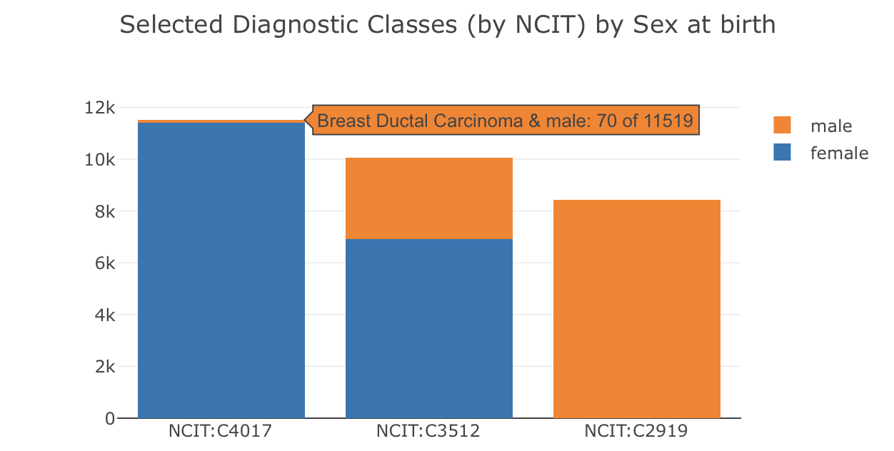

# Beacon Aggregations for Data Summaries

!!! warning "WiP"

    Beacon aggregations are currently work in progress and may change without deprecation. They are **not** part of the official version 2.n specification and should not be implemented in production environments yet. Use with caution for testing, follow related PRs and provide feedback!

    * [Proposals for Aggregated Response](https://github.com/ga4gh-beacon/beacon-v2/discussions/238)

## Overview and Use Cases

While the `Beacon` API provides different ways to discover and potentially retrieve
data in biomedical genomics resources, with version 2.n responses were limited to
global content (boolean or overall count of matched data and static collection information)
or full record level access which for most resources would not be possible in a
public context. Responses under the new `aggregated` granularity level allow to:

* provide granular data overwiews about the content of resources and their collections,
  e.g. numbers of samples with individual features or combinations of features
* profile query responses for multiple (single or intersected) parameters

## Response Format

Aggregation are provided inside the `responseAggregation` property of the response and consist
of array of objects with the following structure:

* a required, ordered list of one or more `concepts` objects, describing the
parameters for which the aggregation is provided
* summaries for the single or interssected concepts
    - `distinctValuesCount`: a count of the distinct values for single or intersected concepts and/or
    - `anyValueCount`: a count for all records with existing values and/or 
    - `distribution`: a distribution of all distinct values/combinations with the count of their occurrence
* an optional `scope` parameter to indicate the entity the results refer to (usually the current entry type but might be variable for collection and overview aggregations)

The following examples display different aggregation objects (which would be items in the `responseAggregation` array). Note that **id values are for demonstration only** and do not have a normative function.

**Aggregations and Queries:** For most of the example cases one can envision both a use in "data overview context" (e.g. to profile the content of a resource or collection) and in "query context" (e.g. to profile the response for a specific query).

### Examples: Representation of Distinct Values Count `distinctValuesCount`

The most basic count - getting the number of samples:

```json
{
  "concepts": [
    {"id": "biosampleCount", "property": "biosample.id"}
  ],
  "distinctValuesCount": 258545
}
```

How many different diseases are represented in the data?

```json
{
  "concepts": [
    {"id": "disease", "label": "Disease"}
  ],
  "distinctValuesCount": 89
}
```

### Example: Informative Values `anyValueCount`

How many individuals in the data have a follow-up time?

```json
{
  "scope": "individual",
  "concepts": [
    {"id": "followUpTime", "label": "Follow-up time"}
  ],
  "anyValueCount": 1200
}
```

### Example: Value Distribution `distribution`, Single Property

What is the distribution of diseases in the samples?

```json
{
  "scope": "biosample",
  "concepts": [
    {
      "id": "sampleDiagnoses",
      "label": "Diagnoses of selected carcinoma types",
      "property": "biosample.histologicalDiagnosis.id"
    }
  ],
  "distribution": [
    {
      "conceptValues": [
        {"id": "NCIT:C2919", "label": "Prostate Adenocarcinoma"}
      ],
      "count": 426
    },
    {
      "conceptValues": [
        {"id": "NCIT:C4017", "label": "Breast Ductal Carcinoma"}
      ],
      "count": 423
    },
    {
      "conceptValues": [
        {"id": "NCIT:C3512", "label": "Lung Adenocarcinoma"}
      ],
      "count": 317
    }
  ]
}
```

### Example: Value Distribution `distribution`, Intersecting Concepts

What is the distribution of diseases in the samples, separately by sex?
Please note:

{ style="float: right; margin: 20px 0px 10px 20px; width: 350px" }

* there are now **2 concepts** in the `concepts` list and the `conceptValues` in the distribution are observed combinations of values for both concepts, in the **same order**
* the `count` indicates the number of times this combination was observed (e.g. 8421 cases of "male" & "Prostate Adenocarcinoma" but 0 cases for "female" & "Prostate Adenocarcinoma")

[{ style="float: left; margin: 5px 20px 5px 0px; width: 100px" }](https://plotly.com/javascript/)

The stacked bar chart was generated in Plotly.js from the Beacon 2D aggregation in the example below, directly derived from the response JSON on the Progenetix site and reflecting the resource's content.

```json
{
  "scope": "individual",
  "concepts": [
    {"id": "selectedDiseases", "label": "Selected carcinoma types"},
    {"id": "sexAtBirth", "label": "Sex at birth"}
  ],
  "distribution": [
    {
      "conceptValues": [
        {"id": "NCIT:C2919", "label": "Prostate Adenocarcinoma"},
        {"id": "NCIT:C20197", "label": "male"}
      ],
      "count": 8421
    },
    {
      "conceptValues": [
        {"id": "NCIT:C2919", "label": "Prostate Adenocarcinoma"},
        {"id": "NCIT:C16576", "label": "female"}
      ],
      "count": 0
    },
    {
      "conceptValues": [
        {"id": "NCIT:C4017", "label": "Breast Ductal Carcinoma"},
        {"id": "NCIT:C16576", "label": "female"}
      ],
      "count": 11449
    },
    {
      "conceptValues": [
        {"id": "NCIT:C4017", "label": "Breast Ductal Carcinoma"},
        {"id": "NCIT:C20197", "label": "male"}
      ],
      "count": 70
    },
    {
      "conceptValues": [
        {"id": "NCIT:C3512", "label": "Lung Adenocarcinoma"},
        {"id": "NCIT:C16576", "label": "female"}
      ],
      "count": 6928
    },
    {
      "conceptValues": [
        {"id": "NCIT:C3512", "label": "Lung Adenocarcinoma"},
        {"id": "NCIT:C20197", "label": "male"}
      ],
      "count": 3112
    }
  ]
}
```

## Definition of Aggregation Concepts

Similar to `.../filtering_terms/` (see [filters](filters.md)) beacons should indicate their
supported aggregations in the `.../aggregation_terms/` endpoint which allows clients
to dynamically discover the available aggregations and their semantics. Aggregation
terms provide **single**, _i.e._ 1-dimensional concepts, usually referring to a
single property in the data model. 2D aggregations - reporting the occurrence of
intersecting values, e.g. combining concepts for "diseases" and "sex at birth",
are simply derived from those.

Aggregation concepts can have additional modifiers:

* `filters` - to limit the aggregations to subsets of the data, e.g. to a selection
  of disease codes
    - If `filters` are indicated for an aggregation concept, only aggregations
      for the concept's property fulfilling the individual filters will be reported
    - Without `filters` all values for the property will be reported (with potential limits
      imposed by the beacon).
    - The usual filter definitions apply; _i.e._ if an ontology term is used as
      filter value the count will include all records with this term or any of
      its child terms (unless an `includeDescendantTerms` flag is set to `False`)
* `splits` - to partition continuous data such as age values, followup times or other numeric measurements into countable bins
    - Note: `splits` are upper & exclusive boundaries of bins, following established practices (_cf._ `$split` use in [MongoDB aggregation pipelines](https://www.mongodb.com/docs/manual/reference/operator/aggregation/split/))

* a `sorted` flag, to indicate that the aggregation results are returned in a
pre-sorted order with some inherent meaning (e.g. age bins)
* a `format` property to indicate the format of the values, e.g. for age splits provided in ISO8601 duration format

### Basic example

```yaml
id: sampleOriginDetails
label: Anatomical Origin
description: >-
  Counts for anatomical sites in matched biosamples
property: biosample.sample_origin_detail.id
```

### `filters` Example

```yaml
selectedDiseases:
  id: selectedDiseases
  label: Selected Diagnostic Classes (by NCIT)
  property: individual.diseases.disease_code.id
  filters:
    - id: NCIT:C2919
      label: Prostate Adenocarcinoma
    - id: NCIT:C4017
      label: Breast Ductal Carcinoma
    - id: NCIT:C3512
      label: Lung Adenocarcinoma
```

### `splits` Example

```yaml
ageAtSampleCollection:
  id: ageAtSampleCollection
  label: Age at sample collection
  description: >-
    Age at diagnosis (sample collection...)
  property: biosample.collection_moment
  format: iso8601duration
  splits:
    - value: P18Y
      label: < 18 years
    - value: P65Y
      label: < 65 years
    - value: P120Y
      label: 65+ years
  sorted: True
```

## Requesting Aggregations

!!! info "Use `aggregated` Granularity"

    Aggregation responses are invoked by setting the granularity parameter to `aggregated` in the request: `?requestedGranularity=aggregated`. This indicates that the client is not interested in record level responses but rather in aggregated summaries of the data content.


To request specific aggregations from the ones indicated at the `.../aggregation_terms`
endpoint clients can use the `aggregators` query parameter which itself is an array
of arrays of concepts. 

=== "POST Request Example"

    In this example 2 aggregations are requested: A simple 1D aggregation for the `sampleOriginDetails` concept and a 2D aggregation for the combination of `selectedDiseases` and `sexAtBirth`.

    ```json
    "aggregators": [
      [
        {"id": "sampleOriginDetails"}
      ],
      [
        {"id": "selectedDiseases"},
        {"id": "sexAtBirth"}
      ]
    ]
    ```

=== "GET Request Example"

    The **non normative** `GET` example uses a standard comma concatenation for
    the outer `aggregators` list and square brackets `[]` for nesting and indication
    of intersecting concepts.

    ```
    ?aggregators=[sampleOriginDetails],[selectedDiseases,sexAtBirth]
    ```


