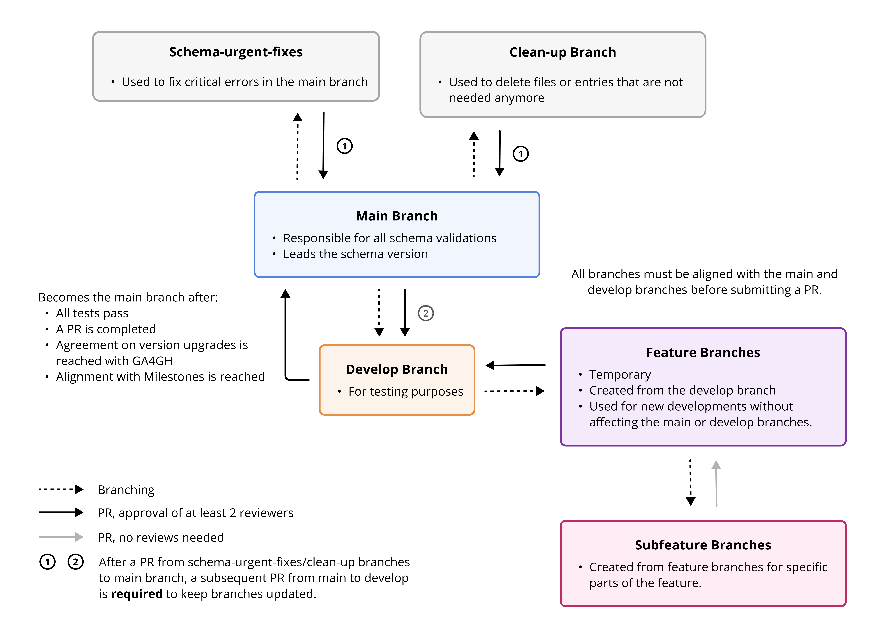

# Repository and Branch Organization

The development of Beacon code and documentation happens in the [`beacon-v2` repository](https://github.com/ga4gh-beacon/beacon-v2).

## Core branches

### `main`

The `main` branch is the branch used for production, it reflects the last version that beacon v2 has reached by accomplishing the milestones that ga4gh has set for the beacon to be considered as a new version. It can only be committed by a PR from the develop branch and exceptionally by some hotfixes to correct errors spotted after its official deployment.

### `develop`

The `develop` branch is the branch used for development, it reflects the current state of the progress of development. It can be modified by all the PR from the feature branches that have been finished (this means that must include all the merges from the subfeature branches) and the PR must reach a consensus to be finally accepted.

### `website-docs`

This branch is used to maintain the website at <https://docs.genomebeacons.org>. The relevant files consists of anything under `/docs` as well as the configuration file (`/mkdocs.yaml`) and the workflow file for processing the pages under `/.github/workflows/mk-beacon-docs.yaml`.

Changes to the Markdown files in the `/docs` directory (and its children) will initiate the processing of the workflow file; updating of the website than may take some minutes.

### `gh-pages`

The `gh-pages` branch is generated from the `/docs` directory through its `mkdocs` workflow and contains the website itself. **Do not edit**

## Hotfix branches

These are the branches that are meant to fix some bugs that break the specifications and need an urgent fix. The branches are directly deployed towards the `main` branch.

### `schema-urgent-fixes`

Some of the instances of the schema were missing attributes and other aspects that are required to make a beacon work. This is mandatory to be urgently fixed and this is the purpose of this branch deployment.

### Clean-up branches

There is always a number of branches used to implement fixes and test features.
Please participate in the Beacon developer calls if you want to stay up-to-date...

## Feature and subfeature branches

The feature branches are the branches that bring a lot of changes together to change some specific part of the specifications. They can be composed by different subfeature branches that commit to them or just have one single working branch. The feature branches commit to the `develop` branch as they are the changes that will lead beacon to be upgraded to a new version. The subfeature branches commit to their parent feature branch, as they are a microchange of all the aspects that have to change in a new feature that is being developed. The branches are named as the main purpose of them, so it is made very clear what is the working area of them and the subfeature branches add the name of the feature branch they belong as a prefix followed by an underscore. The list of these feature branches with their subfeature branches is the one shown next:

