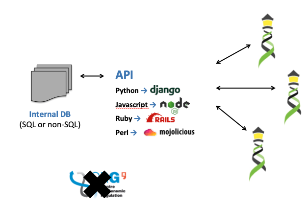
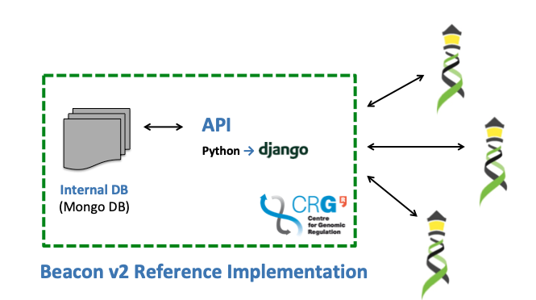

!!! Important
    As previously described, **Beacon v2 is an specification** for sharing/discovery of data. Thus, _a priori_, it has nothing to do with any particular software, database or computer language.

# Which are the implementation options?

Two elements are needed to implement (or "light") a Beacon v2: 

1. An internal **database** (where the biological data are stored).
2. A **REST API** that provides a standardized way to send queries and receive responses (containing yes/no, counts or data).

In this section we are going to present three implementation options, going from no involvement/delegate to [CRG](https://www.crg.eu) software to full delegate to [CRG](https://www.crg.eu) software.

## Option A

Let's say that you have your data organized and structured in a database (e.g. [SQL](https://en.wikipedia.org/wiki/SQL) or [NoSQL](https://en.wikipedia.org/wiki/NoSQL) which may or may not have an internal layer to get access to it). Let's also say that you have the resources (and knowledge) to read the "instructions" (i.e., Beacon v2 specification) to build an API on top of your existing solution. If that's your case, then this is the option for you. You are one of what we call **Beacon v2 API implementers**. We have a few of them already in the [Beacon v2 Service Registry](https://ga4gh-approval-service-registry-demo.ega-archive.org):

 * [European Genome-Phenome Archive Beacon](https://ga4gh-approval-beacon.ega-archive.org/api/info)
 * [Cafe Variome](https://beaconv2.cafevariome.org/form)
 * [`bycon` Python stack](http://bycon.progenetix.org) driving full featured v2 under the [Progenetix](https://progenetix.org) resource
 * [Fundacion Progreso y Salud Beacon v2 API](https://csvs-beacon.clinbioinfosspa.es/csvs/ga4ghbeacon/v2/api/)
 * [CNAG Beacon v2 API](https://playground.rd-connect.eu/beacon2/api)

## Option B

Let's say that you have a solution to organize your data but you don't have the resources (or knowledge) to implement a Beacon v2 API yourself. In some pilot studies, [CRG](https://www.crg.eu) has been helping individual institutions to build their Beacon v2 API. However, this option is not practical and does not scalate well so you may want to check **Option C**.

## Option C

Let's say that you have your data _somewhat_ structured (you may have Excel files, PDFs, VCFs... or maybe a SQL database, or an [EHR](https://en.wikipedia.org/wiki/Electronic_health_record) solution with phenoclinic information). 

You want to "beaconize" your data to be part of a larger ecosystem, but you're unsure where to start, and/or don't want to invest a lot of resources because you are still unsure if the whole thing will pay off. Well, you're a not alone! Most centers are in this situation. For that reason at [CRG](https://www.crg.eu) we developed the **Beacon v2 Reference Implementation**.

!!! Important
    People that download and install _B2RI_ are named **Beacon v2 deployers**.
