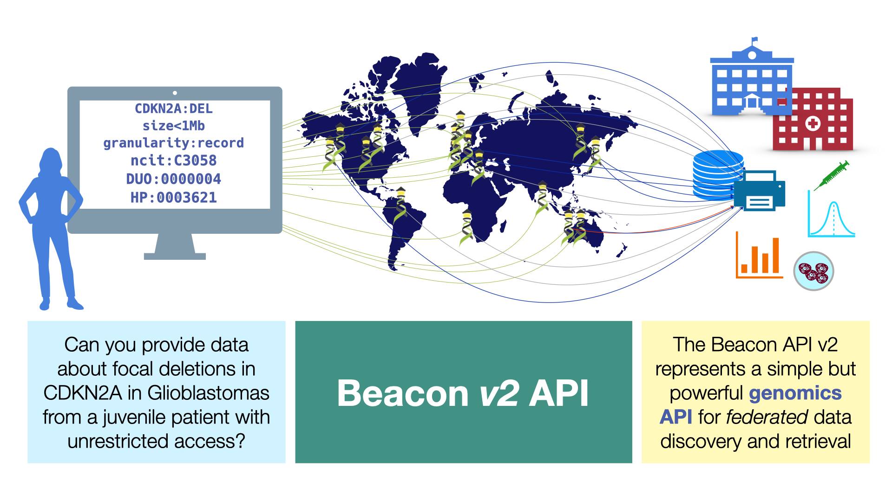

# Welcome to the Beacon v2 Documentation

!!! Note "A SDtandard of the Global Alliance for Genomics and Health GA4GH"

        On [2022-04-21](formats-standards/#dates-and-times) Beacon v2 has been approved as an official [GA4GH standard](https://www.ga4gh.org/) through the GA4GH steering committee.

With growing interest from the community in the implementation of the Beacon protocol
into resources and workflows, the major 2.0 release in 2022 introduced a large range of
[new features](what-is-beacon-v2.md) which were considered important by the community.

!!! Warn "Move to Beacon v2"

    With the release of Beacon v2 implementations of v1 and earlier are not longer supported.
    Deployers of Beacon instances or networks are advised to migrate to v2 of the
    standard. The functionality of Beacon v1 [can be easily implemented in v2](/FAQ/#v1-emulation). 

<figure markdown>
  { width="750" }
  <figcaption>Beacon v2 specification</figcaption>
</figure>

The core documentation (i.e. this document) can be found on [here](http://docs.genomebeacons.org).

## Informations for Different Types of Beacon Users

The Beacon documentation provides information for different types of users,
depending on their interests and use cases. Although those will overlap, we highlight
information relevant for some general scenarios throughout the documentation.

### Users

A Beacon **user** (or end-user) is interested in querying Beacon instances and networks, either through
web interfaces by using the Beacon API. While users of Beacon web forms in principle
do not need to understand the underlying query syntax and response formats they too may
benefit from some insights into the general capabilities of the underlying protocol.

!!! Warning "User"
    * Beacon v2 [Models](models.md)
    * Knowing what is available in an instance
        * Data [Models and Schemas](models.md)
        * Beacon [Flavours](beacon-flavours.md) & Response Granularity
        * [Security](security.md) 
        * Other Request, Response & Error Elements
    * Using Beacon v2 Features
        * Genomic [Variant Queries](variant-queries.md)
        * [Filters](filters.md) for Phenotypes, Diseases & Other Parameters
        * Alternative Schemas [Link](models.md)

<!--        * [OpenAPI](https://www.openapis.org) -->

### Deployers and Implementers

A Beacon **Deployer** is someone who wants to make their genomics resource accessible
through the Beacon protocol, without necessarily being interested or experienced in the
computational aspects; while a Beacon **Implementer** provides the technical expertise (and
potentially may get involved with Beacon development itself, e.g. to extend the protocol
for novel use cases). 

!!! Important "Deployer"

    * Beacon v2 [Models](models.md)

    * Reference Implementation [Link](https://b2ri-documentation.readthedocs.io/en/latest/)
        * Infrastructure requirements
        * How to install
        * [Configuration](https://github.com/EGA-archive/beacon-2.x)
            * Cohorts and/or Datasets
            * Entry types
            * Filtering terms
            * Alternative schemas
            * Granularity & Security
        * Administration
        * Testing the instance

!!! Note "Implementer"

    * Beacon v2
        * [Framework](framework.md)
        * [Models](models.md)
    * Protocol basics
        * [Requests](variant-queries.md), responses & errors
        * [OpenAPI](https://www.openapis.org)
    * Beacon v2 Features
        * [Filters](filters.md)
        * Alternative schemas [Link](models.md)
    * Configuration
        * Granularity & security [Link](framework.md)
    * Verifying [compliance](https://ga4gh-approval-service-registry-demo.ega-archive.org/)

### Stakeholder

!!! Danger "Stakeholder"
    * Integration into GA4GH
    * Leveraging The Beacon Framework in other domains
    * Success Stories:
        * [Implementations](other-implementations.md)
        * Real world data
