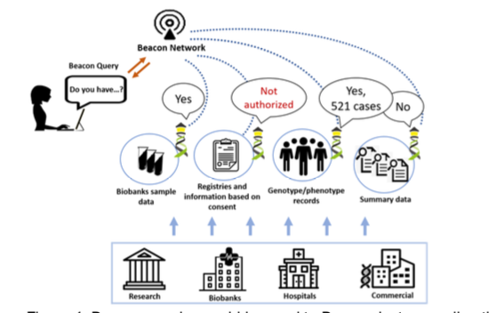

# Beacon Networks

Many Beacon instances will be part of networks, although a Beacon can be instantiated as stand-alone solution. The Beacon design includes several features aimed to be consumed by Beacon network aggregators. For example, a Beacon endpoint declares which entities are implemented in that particular instance, which are the ontology terms supported or the URL endpoints where different elements could be found.

<figure markdown>
  { width="750" }
  <figcaption>Beacon v2 Networks</figcaption>
</figure>
