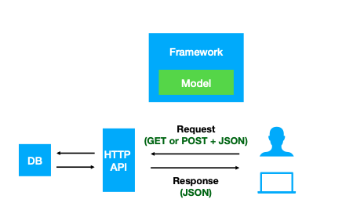

# Are you planning to implement a Beacon v2 API from scratch?

If this is the case, these are some things to get you started:



1. Start with a [boolean](beacon-flavours.md) beacon
2. List your available [endpoints](framework.md)
3. Map the data from your DB to the [Models](models.md) {{config.repo_models_icon}}
4. Handle the different types of [filters](filters.md)
5. Build a response following the [Framework](framework.md) {{config.repo_framework_icon}}

## Request Example

```json
{
  "meta": {
    "apiVersion": "v2.0",
    "requestedSchemas": [
      {
        "entityType": "biosample",
        "schema": "https://raw.githubusercontent.com/ga4gh-beacon/beacon-v2/main/models/json/beacon-v2-default-model/biosamples/defaultSchema.json"
      }
    ]
  },
  "query": {
    "requestParameters": {
      "datasets": {
        "datasetIds": [
          "DatasetXYZ",
          "Dataset123"
        ]
      }
    },
    "filters": [
      {
        "id": "EFO:0001212",
        "scope": "biosamples"
      }
    ],
    "includeResultsetResponses": "HIT",
    "pagination": {
      "skip": 0,
      "limit": 10
    },
    "requestedGranularity": "count"
  }
}
```

## Response Example

```json
{
  "meta": {
    "beaconId": "org.example.beacon.v2",
    "apiVersion": "v2.0",
    "returnedSchemas": [
      {
        "entityType": "biosample",
        "schema": "https://raw.githubusercontent.com/ga4gh-beacon/beacon-v2/main/models/json/beacon-v2-default-model/biosamples/defaultSchema.json"
      }
    ],
    "receivedRequestSummary": {
      "apiVersion": "v2.0",
      "filters": "...",
      "requestParameters": "...",
      "includeResultsetResponses": "HIT",
      "requestedSchemas": [
        {
          "entityType": "biosample",
          "schema": "https://raw.githubusercontent.com/ga4gh-beacon/beacon-v2/main/models/json/beacon-v2-default-model/biosamples/defaultSchema.json"
        }
      ],
      "pagination": {
        "skip": 0,
        "limit": 10
      },
      "requestedGranularity": "count"
    }
  },
  "responseSummary": {
    "exists": true,
    "numTotalResults": 25355
  },
  "info": {
    "someInterestingStuff": "this is the interesting stuff"
  },
  "beaconHandovers": [
    {
      "handoverType": {
        "id": "EFO:0004157",
        "label": "BAM format"
      },
      "url": "https://api.mygenomeservice.org/Handover/9dcc48d7-fc88-11e8-9110-b0c592dbf8c0",
      "note": "This handover link provides access to a summarized VCF."
    }
  ]
}
```
