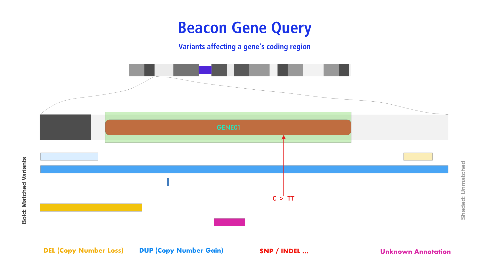

# Genomic Variant Queries

For querying of genomic variations Beacon v2 builds on and extends the options provided
by earlier versions.

## Beacon _Sequence Queries_

_Sequence Queries_ query for the existence of a specified sequence at a given genomic
position. Such queries correspond to the original Beacon queries and are used to match
short, precisely defined genomic variants such as SNVs and INDELs.

#### Parameters

* `referenceName`
* `start` (single value)
* `alternateBases`
* `referenceBases`

#### Example: _EIF4A1_ Single Base Mutation

This is an example for a single base mutation (`G>A`) at a specific position (GRCh38 chromosome 17 `7577120`)
in the _EIF4A1_ eukaryotic translation initiation factor 4A1.

=== "Beacon v2 GET"

	```
	?referenceName=NC_000017.11&start=7577120&referenceBases=G&alternateBases=A
	```

	#### Optional

	* `datasetIds=__some-dataset-ids__`
	* `filters` ...


=== "Beacon v2 POST"

	```
	{
	    "$schema":"beaconRequestBody.json",
	    "meta": {
	        "apiVersion": "2.0",
	        "requestedSchemas": [
	            {
	                "entityType": "genomicVariation",
	                "schema:": "https://raw.githubusercontent.com/ga4gh-beacon/beacon-v2/main/models/json/beacon-v2-default-model/genomicVariations/defaultSchema.json"
	            }
	        ]
	    },
	    "query": {
	        "requestParameters": {
	        	"g_variant": {
	                "referenceName": "NC_000017.11",
	                "start": [7577120],
	                "referenceBases": "G",
	                "alternateBases": "A"
		    	}
	        }
	    },
	    "requestedGranularity": "record",
	    "pagination": {
	        "skip": 0,
	        "limit": 5
	    }
	}
	```

	There are optional parameters [`datasetIds`, `filters` ...] and also the option to specify the response type
	(through `requestedGranularity`) and returned data format (`requestedSchemas`). Please follow this up in the
	[framework documentation](framework.md).


=== "Beacon v1"

	```
	?assemblyId=GRCh38&referenceName=17&start=7577120&referenceBases=G&alternateBases=A
	```

	#### Optional

	* `datasetIds=__some-dataset-ids__`

=== "Beacon v0.3"

	```
	?ref=GRCh38&chrom=17&pos=7577121&referenceAllele=C&allele=A
	```

	#### Optional

	* `beacon=__some-beacon-id__`

	Before Beacon v0.4 a 1-based coordinate system was being used.


## Beacon _Range Queries_

Beacon _Range Queries_ are supposed to return matches of any variant with at least
partial overlap of the sequence range specified by `reference_name`, `start` and `end`
parameters.


#### Parameters

* `referenceName`
* `start` (**single** value)
* `end` (**single** value)
* optional
	- `variantType` **OR** `alternateBases` **OR** `aminoacidChange`
	- `variantMinLength`
	- `variantMaxLength`

!!! Warning "Use of `start` and `end`"

    Range queries require the use of **single** `start` and `end` parameters, in contrast
    to _Bracket Queries_.

#### Example: Any variant affecting _EIF4A1_ 

=== "Beacon v2 GET"

	```
	?assemblyId=GRCh38&referenceName=17&start=7572837&end=7578641
	```

=== "Beacon v2 POST"

	```
	{
	    "$schema":"https://raw.githubusercontent.com/ga4gh-beacon/beacon-v2/main/framework/json/requests/beaconRequestBody.json",
	    "meta": {
	        "apiVersion": "2.0",
	        "requestedSchemas": [
	            {
	                "entityType": "genomicVariation",
	                "schema:": "https://raw.githubusercontent.com/ga4gh-beacon/beacon-v2/main/models/json/beacon-v2-default-model/genomicVariations/defaultSchema.json"
	            }
	        ]
	    },
	    "query": {
	        "requestParameters": {
	            "g_variant":
	                "referenceName": "NC_000017.11",
	                "start": [ 7572837 ],
	                "end": [ 7578641 ]
		    	}
	        }
	    },
	    "requestedGranularity": "record",
	    "pagination": {
	        "skip": 0,
	        "limit": 5
	    }
	}
	```

=== "Beacon v1"

	Range Queries are new to Beacon v2

=== "Beacon v0.3"

	Range Queries are new to Beacon v2


## Beacon _GeneId Queries_

_GeneId Queries_ are in essence a variation of _Range Queries_ in which the coordinates
are replaced by the [HGNC](https://www.genenames.org) gene symbol. It is left to the
implementation if the matching is done on variants annotated for the gene symbol or if
a positional translation is being applied.




#### Parameters

* `geneId`
* optional
	- `variantType` **OR** `alternateBases` **OR** `aminoacidChange`
	- `variantMinLength`
	- `variantMaxLength`

=== "Beacon v2 GET for `geneId` (deletion CNV)"

	```
	?geneId=EIF4A1&variantMaxLength=1000000&variantType=DEL
	```

=== "Beacon v2 POST for `geneId` (deletion CNV)"

	```
	{
	    "$schema":"https://raw.githubusercontent.com/ga4gh-beacon/beacon-v2/main/framework/json/requests/beaconRequestBody.json",
	    "meta": {
	        "apiVersion": "2.0",
	        "requestedSchemas": [
	            {
	                "entityType": "genomicVariation",
	                "schema:": "https://raw.githubusercontent.com/ga4gh-beacon/beacon-v2/main/models/json/beacon-v2-default-model/genomicVariations/defaultSchema.json"
	            }
	        ]
	    },
	    "query": {
	        "requestParameters": {
	            "g_variant":
	                "geneId": "EIF4A1",
	                "variantType": "EFO:0030067"
		    	}
	        }
	    },
	    "requestedGranularity": "record",
	    "pagination": {
	        "skip": 0,
	        "limit": 5
	    }
	}
	```


## Beacon _Bracket Queries_

_Bracket Queries_ allow the specification of sequence ranges for both start and end
positions of a genomic variation. The typical example here is the query for similar
structural variants - particularly CNVs - affecting a genomic region but potentially
differing in their exact base extents.


#### Parameters

* `referenceName`
* `start` (min) and `start` (max) - i.e. 2 start parameters
* `end` (min) and `end` (max) - i.e. 2 end parameters
* `variantType` (optional)

!!! Warning "Use of `start` and `end`"

    Bracket queries require the use of **two** `start` and `end` parameters, in contrast
    to _Range Queries_.

!!! Attention "List Parameters in GET Requests"

	Since the direct interpretation of list parameters in queries is not supported by
	some server environments (e.g. PHP, GO…), list parameters such as `start` and `end`
	should be provided as **comma-concatenated** strings when using them in GET requests.


#### Example: CNV Query - _TP53_ Deletion Query by Coordinates

The following example shows a "bracket query" for focal deletions of the _TP53_ gene locus:

* The start of the deletion has to occurr anywhere from approx. 2.5Mb 5' of the CDR start to just before the end of the CDR.
* The end of the matched CNVs has to be anywhere from the start of the gene locus to approx. 2.5Mb 3' of its end.

This leads to matching of deletion CNVs which have at least some base overlap with the gene locus but are not
larger than approx. 5Mb (operational definitions of focality vary between 1 and 5Mb).

=== "Beacon v2 GET"

	```
	?datasetIds=TEST&referenceName=NC_000017.11&variantType=DEL&start=5000000,7676592&end=7669607,10000000
	```

	#### Optional

	* `datasetIds=__some-dataset-ids__`
	* `filters` ...


=== "Beacon v2 POST"

	```json
	{
	    "$schema":"https://raw.githubusercontent.com/ga4gh-beacon/beacon-v2/main/framework/json/requests/beaconRequestBody.json",
	    "meta": {
	        "apiVersion": "2.0",
	        "requestedSchemas": [
	            {
	                "entityType": "genomicVariation",
	                "schema:": "https://raw.githubusercontent.com/ga4gh-beacon/beacon-v2/main/models/json/beacon-v2-default-model/genomicVariations/defaultSchema.json"
	            }
	        ]
	    },
	    "query": {
	        "requestParameters": {
	        	"g_variant": {
	                "referenceName": "NC_000017.11",
	                "start": [ 5000000, 7676592 ],
	                "end": [ 7669607, 10000000 ],
	                "variantType": "DEL"
		    	}
	        }
	    },
	    "requestedGranularity": "record",
	    "pagination": {
	        "skip": 0,
	        "limit": 5
	    }
	}
	```

	There are optional parameters [`datasetIds`, `filters` ...] and also the option to specify the response type
	(through `requestedGranularity`) and returned data format (`requestedSchemas`). Please follow this up in the
	[framework documentation](framework.md).


=== "Beacon v1"

	```
	?assemblyId=GRCh38&referenceName=17&variantType=DEL&start=5000000,7676592&end=7669607,10000000
	```

	#### Optional

	* `datasetIds=__some-dataset-ids__`


=== "Beacon v0.3"

	CNV query options were only implemented with Beacon v0.4, based on Beacon<sup>+</sup> prototyping.


## Genomic Allele Query (Short Form)

When available variants can be identified through their genomic HGVS short form.

=== "Beacon v2 GET"

	```
	?genomicAlleleShortForm=NM_004006.2:c.4375C>T
	```


## Aminoacid Change Query

Annotated variants can potentiallyqueried using the single amino acid replacement
format. The `aminoacidChange` parameter may be combined with e.g. a `geneId` to increase
specificity

=== "Beacon v2 GET"

	```
	?aminoacidChange=V600E&geneId=BRAF
	```


## `variantType` Parameter Interpretation

The `variantType` parameter is essential for scoping queries beyond precise sequence
queries. While versions of Beacon before v2 had demonstrated the use of a few, VCF
derived values (particularly for CNV queries using `DUP` or `DEL`), the relation of these
values to underlying genomic variations had not been precisely defined.

!!! Attention "Implementation of `variantType` in Beacon Instances"

	The current Beacon query model does not limit the use of values for `variantType` since
	at this time no single specification provides unanimous definitions
	of genomic variation categories. 

??? Note "Future `variantType` parameter use"

	While for legacy reasons and widespread use of VCFs as input source Beacon v2 documents
	the use of VCF-like terms, in principle other variant terms can be used (though with possibly negative
	implications in federated settings). The field of structural genomic variant annotations is rapidly
	developing, with more specific terms now becoming available e.g. through the
	Experimental Factor Ontology or the GA4GH Variant Representation Standard VRS
	(which ligns with the main EFO terms).


## CNV Term Use Comparison in Computational (File/Schema) Formats

This table is maintained in parallel with the [hCNV community documentation](https://cnvar.org/resources/CNV-annotation-standards/#cnv-term-use-comparison-in-computational-fileschema-formats).

| [EFO](http://www.ebi.ac.uk/efo/EFO_0030063) | Beacon | [VCF](https://samtools.github.io/hts-specs/) | SO       | GA4GH [VRS](https://vrs.ga4gh.org/en/latest/terms_and_model.html#copynumberchange)[^1] | Notes |
| ------------------------------------------- | ------------------------------------------------------------------------------ | -------------------------------------------- | -------- | ------------------------------------------------------------------------------------------------------------------------------------------------- | ----- |
| <nobr>[`EFO:0030070`](http://www.ebi.ac.uk/efo/EFO_0030070)</nobr> copy number gain | `DUP`[^2] or<br/><nobr>[`EFO:0030070`](http://www.ebi.ac.uk/efo/EFO_0030070)</nobr> | `DUP`<br/><nobr>`SVCLAIM=D`[^3]</nobr> | [`SO:0001742`](http://www.sequenceontology.org/browser/current_release/term/SO:0001742) copy_number_gain | <nobr>[`EFO:0030070`](http://www.ebi.ac.uk/efo/EFO_0030070) gain  | a sequence alteration whereby the copy number of a given genomic region is greater than the reference sequence |
| [`EFO:0030071`](http://www.ebi.ac.uk/efo/EFO_0030071) low-level copy number gain| `DUP`[^2] or<br/><nobr>[`EFO:0030071`](http://www.ebi.ac.uk/efo/EFO_0030071)</nobr> | `DUP`<br/><nobr>`SVCLAIM=D`[^3]</nobr> | [`SO:0001742`](http://www.sequenceontology.org/browser/current_release/term/SO:0001742) copy_number_gain   | <nobr>[`EFO:0030071`](http://www.ebi.ac.uk/efo/EFO_0030071)</nobr> low-level gain |                                                                                                                             |
| [`EFO:0030072`](http://www.ebi.ac.uk/efo/EFO_0030072) high-level copy number gain | `DUP`[^2] or<br/><nobr>[`EFO:0030072`](http://www.ebi.ac.uk/efo/EFO_0030072)</nobr> | `DUP`<br/><nobr>`SVCLAIM=D`[^3]</nobr> | [`SO:0001742`](http://www.sequenceontology.org/browser/current_release/term/SO:0001742) copy_number_gain | <nobr>[`EFO:0030072`](http://www.ebi.ac.uk/efo/EFO_0030072)</nobr> high-level gain | commonly but not consistently used for >=5 copies on a bi-allelic genome region                                             |
| [`EFO:0030073`](http://www.ebi.ac.uk/efo/EFO_0030073) focal genome amplification  | `DUP`[^2] or<br/><nobr>[`EFO:0030073`](http://www.ebi.ac.uk/efo/EFO_0030073)</nobr> | `DUP`<br/><nobr>`SVCLAIM=D`[^3]</nobr> | [`SO:0001742`](http://www.sequenceontology.org/browser/current_release/term/SO:0001742) copy_number_gain | <nobr>[`EFO:0030072`](http://www.ebi.ac.uk/efo/EFO_0030072)</nobr> high-level gain[^4]  | commonly but not consistently used for >=5 copies on a bi-allelic genome region, of limited size (operationally max. 1-5Mb) |
| [`EFO:0030067`](http://www.ebi.ac.uk/efo/EFO_0030067) copy number loss            | `DEL`[^2] or<br/><nobr>[`EFO:0030067`](http://www.ebi.ac.uk/efo/EFO_0030067)</nobr> | `DEL`<br/><nobr>`SVCLAIM=D`[^3]</nobr> | [`SO:0001743`](http://www.sequenceontology.org/browser/current_release/term/SO:0001743) copy_number_loss | <nobr>[`EFO:0030067`](http://www.ebi.ac.uk/efo/EFO_0030067)</nobr> loss            | a sequence alteration whereby the copy number of a given genomic region is smaller than the reference sequence              |
| [`EFO:0030068`](http://www.ebi.ac.uk/efo/EFO_0030068) low-level copy number loss  | `DEL`[^2] or<br/><nobr>[`EFO:0030068`](http://www.ebi.ac.uk/efo/EFO_0030068)</nobr> | `DEL`<br/><nobr>`SVCLAIM=D`[^3]</nobr> | [`SO:0001743`](http://www.sequenceontology.org/browser/current_release/term/SO:0001743) copy_number_loss | <nobr>[`EFO:0030068`](http://www.ebi.ac.uk/efo/EFO_0030068)</nobr> low-level loss  |                                                                                                                             |
| [`EFO:0020073`](http://www.ebi.ac.uk/efo/EFO_0020073) high-level copy number loss  | `DEL`[^2] or<br/><nobr>[`EFO:0020073`](https://github.com/EBISPOT/efo/issues/1941)</nobr> | `DEL`<br/><nobr>`SVCLAIM=D`[^3]</nobr> | [`SO:0001743`](http://www.sequenceontology.org/browser/current_release/term/SO:0001743) copy_number_loss | <nobr>[`EFO:0020073`](https://github.com/EBISPOT/efo/issues/1941)</nobr> high-level loss  | a loss of several copies; also used in cases where a complete genomic deletion cannot be asserted |
| [`EFO:0030069`](http://www.ebi.ac.uk/efo/EFO_0030069) complete genomic deletion   | `DEL`[^2] or<br/><nobr>[`EFO:0030069`](http://www.ebi.ac.uk/efo/EFO_0030069)</nobr> | `DEL`<br/><nobr>`SVCLAIM=D`[^3]</nobr> | [`SO:0001743`](http://www.sequenceontology.org/browser/current_release/term/SO:0001743) copy_number_loss | <nobr>[`EFO:0030069`](http://www.ebi.ac.uk/efo/EFO_0030069)</nobr> complete genomic loss   | complete genomic deletion (e.g. homozygous deletion on a bi-allelic genome region)                                          |


##### Last updated 2023-07-13 to align with 2023-03-22 hCNV documentation (VRS 1.3 adjustment) by @mbaudis
##### updated 2023-03-20 by @mbaudis (VRS proposal)

## Query Parameter Change Log

<!--TODO: Should this go to a separate Beacon chamges page and be referenced?-->

### Beacon v2

* use of sequence reference id's which obviate the need for a `assemblyId` parameter
* **range queries**
	- with specified single start and end parameters a query should match any vatiant
	with partial or complete overlap with this sequence range
	- additional parameters (e.g. `referenceBases`, `alternateBases`, `variantType`...)
	may be used to scope the range query
* query by `aminoacidChange`
* query by `geneId`
* `variantMinLength`, `variantMaxLength`

### Beacon v1 (based on v0.4)

* switch to _0-based interbase_ coordinates for the API with _1-based_ coordinates
recommended for query forms
	- this represents the common GA4GH usage and the practice e.g. of the UCSC genome browser
* introduction of _bracketed queries_
	- specification of intervals for `start` and `end` positions when querying multi-base
	variants allows for "fuzzy" CNV queries
* support of a `variantType` parameter to specify e.g. CNV queries (`DUP`, `DEL`)
	- `variantType` is not required for precise queries with specified `referenceBases`
	and `alternateBases`


[^1]: The VRS annotations refer to the status from v1.3 (2022) when 
the new class `CopyNumberChange` ([discussion...](https://github.com/ga4gh/vrs/issues/404#issuecomment-1472599849))
with the use of the EFO terms.
[^2]: While the use of VCF derived (`DUP`, `DEL`) values had been introduced with
beacon v1, usage of these terms has always been a _recommendation_ rather than an integral part
of the API. We now encourage the support of more specific terms (particularly EFO)
by Beacon developers. As example, the Progentix Beacon API [uses EFO terms](http://progenetix.org/search/) but
provides an internal term expansion for legacy `DUP`, `DEL` support.
[^3]: VCFv4.4 introduces an `SVCLAIM` field to disambiguate between _in situ_ events (such as
tandem duplications; known _adjacency_/ _break junction_: `SVCLAIM=J`) and events where e.g. only the
change in _abundance_ / _read depth_ (`SVCLAIM=D`) has been determined. Both **J** and **D** flags can be combined.
[^4]: VRS did not adopt the "amplification" term due to possible inconsistencies


